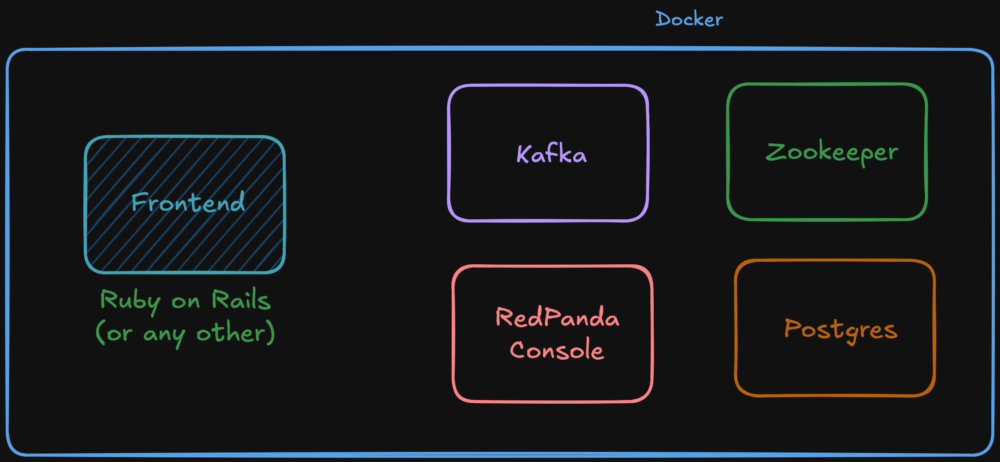
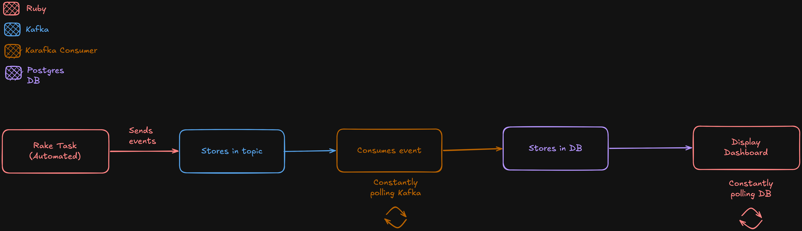

# Event Stream Dashboard

   

---

## So.. What is this?

This is a focused proof of concept designed for a proposal of event-driven architecture before implementing in a production environment.

A script generates marketplace events (user signups, listing views, reviews) which flow through Kafka, get processed by a Karafka consumer, persisted to Postgres and displayed on a dashboard that updates every 2 seconds.

---

## Architecture

### System Architecture



### Event Flow




---

## Tech Stack

| Technology | Role |
|---|---|
| **Ruby on Rails** | Backend API and dashboard |
| **Karafka** | Ruby client for consuming Kafka events |
| **Apache Kafka** | Stores all events across topics |
| **Redpanda Console** | UI for inspecting Kafka topics and messages |
| **Postgres** | Persistent storage for processed events |
| **Docker Compose** | Runs the entire stack with a single command |

---

## Getting Started

### Prerequisites
- [Docker Desktop](https://www.docker.com/products/docker-desktop/)
- That's it.

### Run the app

```bash
git clone https://github.com/yourname/event-stream-dashboard
cd event_app
docker compose up --build
```

| Service | URL |
|---|---|
| Dashboard | http://localhost:3000 |
| Redpanda Console (Kafka UI) | http://localhost:8080 |

---

## Simulating Events

Once the stack is running, generate fake events with:

```bash
docker compose exec rails rails kafka:seed_events
```

This publishes a batch of fake `user.signed_up`, `listing.viewed`, `order.placed`, and `review.submitted` events into Kafka. Watch the dashboard update in real time as Karafka consumes and processes them.

---

## Why Kafka?

Unlike a traditional queue (e.g. Sidekiq/Redis) where a message is deleted once consumed, Kafka stores all event logs. This means:

- Multiple consumers can read the same event independently (Persistence)
- Events can be replayed if a consumer fails

---

## Services

```
docker compose up --build    # Start everything
docker compose down          # Stop everything
docker compose logs -f       # Stream logs from all services
```


Made with ❤️ by Joselson