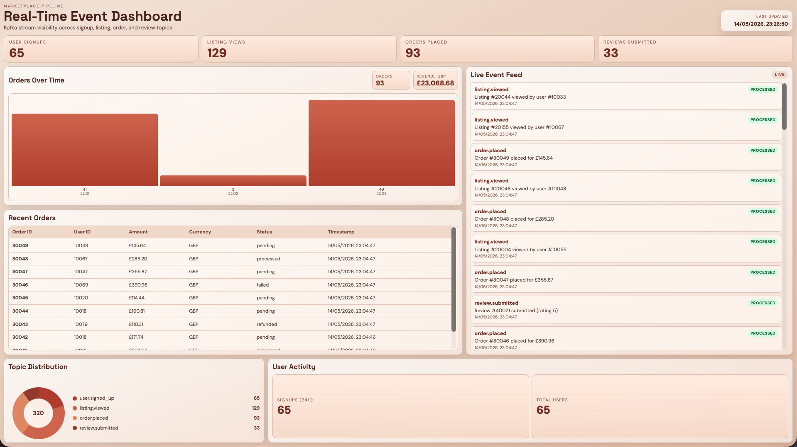
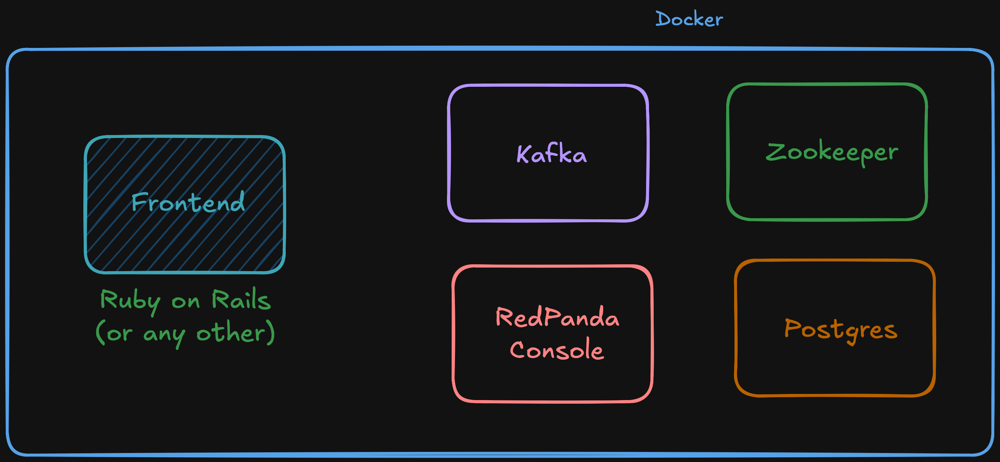
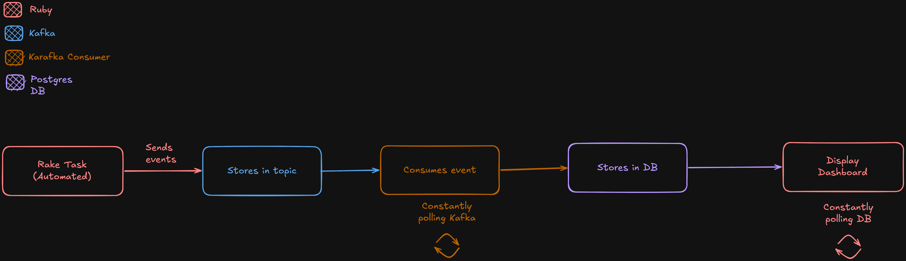

# Event Stream Dashboard




## Overview

This project is a proof-of-concept for an event-driven marketplace pipeline.

I designed and implemented a small end-to-end system where marketplace events are published to Kafka, consumed with Karafka, persisted in Postgres, and visualized in a live dashboard.

Tracked topics:

- `user.signed_up`
- `listing.viewed`
- `order.placed`
- `review.submitted`

**Note:** While this implementation uses Rails, the core event-driven architecture patterns (Kafka producers, consumers, event persistence, and aggregation queries) are **framework-agnostic** and can be adapted to any backend architecture—Node.js, Python, Go, Java, etc. The principles of event publishing, consumption, and stream processing are language and framework independent.

## My Role

I owned the implementation across backend, data flow, and UI:

- Built Kafka producer + Karafka consumer flow
- Implemented event persistence and dashboard aggregation endpoints
- Built a real-time dashboard UI with auto-refresh behavior
- Containerized runtime with Docker Compose (`rails`, `karafka`, `kafka`, `postgres`, `redpanda-console`)
- Added data-seeding tooling to simulate realistic event traffic

## Architecture

### System Architecture



### Event Flow



## Tech Stack

| Technology | Role |
|---|---|
| Ruby on Rails | Dashboard UI + server-side aggregation API |
| Karafka | Kafka consumer runtime |
| Apache Kafka | Event transport and log storage |
| Postgres | Persisted consumed events |
| Redpanda Console | Kafka topic/message inspection |
| Docker Compose | Local orchestration |

## Key Decisions and Tradeoffs

- **Polling over push for v1**: Dashboard refreshes every 3 seconds via JSON polling for lower implementation complexity.
- **Single event store table**: Fast to ship and easy to query; schema kept simple for POC speed.
- **Consumer-first persistence**: Events are stored after consume; feed "pending" state is currently inferred in UI, not persisted.
- **Docker-first local setup**: Reduces machine-specific dependency issues and keeps runtime reproducible.

## Running Locally

### Prerequisites

- [Docker Desktop](https://www.docker.com/products/docker-desktop/)

### Start the stack

```bash
git clone https://github.com/yourname/event-stream-dashboard
cd event_app
docker compose up --build
```

| Service | URL |
|---|---|
| Dashboard | http://localhost:3000 |
| Redpanda Console | http://localhost:8080 |

## Generating Event Traffic

Publish simulated marketplace traffic into Kafka:

```bash
docker compose exec rails rails kafka:seed_events
```

You can tune volume and speed:

```bash
docker compose exec rails env EVENTS=300 DELAY_MS=10 rails kafka:seed_events
```

Supported env vars:

- `EVENTS` (default: `120`) total events to publish
- `DELAY_MS` (default: `25`) delay between publishes in milliseconds
- `USER_POOL` (default: `80`) number of unique users sampled
- `LISTING_POOL` (default: `160`) number of unique listings sampled
- `PUBLISH_TIMEOUT` (default: `10`) timeout per publish attempt (seconds)

## Useful Commands

```bash
docker compose up --build     # start everything
docker compose down           # stop everything
docker compose ps             # service status
docker compose logs -f        # stream logs
docker compose exec rails bash
```

## Testing

Current test coverage includes controller-level validation for dashboard response shape and key metrics.

```bash
# inside a compatible Ruby/Bundler environment
bin/rails test test/controllers/marketplace_events_controller_test.rb
```

## Current Limitations

This repo is intentionally scoped as a POC. Not implemented yet:

- Persisted `pending -> processed` lifecycle in DB (status is currently inferred for recent events)
- True push-based live updates (WebSockets/SSE); dashboard currently uses polling
- Production-grade charting fallback/observability strategy
- Full E2E/system test coverage for responsive behavior
- Formal accessibility and performance profiling pass

## Performance & Scalability

As the system grows to handle higher event throughput and larger datasets, the following enhancements would improve performance and scalability:

### Database Indexing
Strategic indexes on frequently queried columns (e.g., event `type`, `user_id`, `timestamp`, and status) would dramatically reduce query latency for dashboard aggregations and event lookups. Composite indexes on multi-column filters would further optimize complex queries over large event tables.

### gRPC
Replacing HTTP/JSON polling with gRPC would enable:
- Efficient binary serialization (smaller payloads)
- Multiplexing over HTTP/2 (lower connection overhead)
- Better latency for real-time dashboard updates
- Easier integration of additional services (order service, user service, etc.)

### Caching Strategies
Implementing intelligent caching layers would reduce database load and improve response times:
- **Cache-Aside (Lazy Loading)**: Load data into cache on miss; useful for dashboard metrics and aggregations
- **Write-Through/Write-Behind**: Keep cache synchronized with database writes; effective for frequently updated event counters
- **TTL-based expiration**: Configure appropriate TTLs based on data freshness requirements
- **Distributed cache**: Redis or Memcached for shared state across multiple instances

Reference: [ByteByteGo: Top Caching Strategies](https://bytebytego.com/guides/what-are-the-top-caching-strategies/?_gl=1*1dq8m80*_up*MQ..*_ga*MTcwOTE3NzU5LjE3Nzg5MjkzODU.*_ga_JPXSGYZ0D5*czE3Nzg5MjkzODQkbzEkZzAkdDE3Nzg5MjkzODQkajYwJGwwJGgwJGRoMEd4WXV3aGxTZFVVVTE3blpMOWpHQ0dtQ2lGRHdqMVJn)

## Next Iteration

If extended toward production, I would prioritize:

1. Event status lifecycle persistence + idempotency strategy
2. Push updates with ActionCable/SSE for lower latency
3. Stronger test pyramid (request + system + failure-mode tests)
4. Observability: add a dedicated monitoring container stack -maybe ELK??- (for example Grafana + Loki + Prometheus), separate logs by level (`debug`, `info`, `warn`, `error`) and add alerting around consumer lag and publish failures
5. Hardening for multi-instance deployment and auth boundaries
6. Performance optimizations: database indexing, gRPC integration, and caching strategies

---

Made with ❤️ by Joselson
